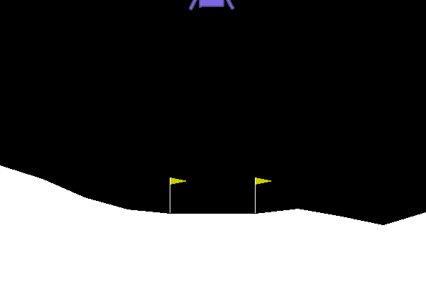

# What are Actor-Critic Methods?

This is another approach to solving the explore/exploit routine and credit assignment problems. The actor chooses with probabilities dependent upon the values of the actions. Instead of choosing the highest-value action, the choice is smoothed out over the set to encourage exploration. The actor updates weights based on the discounted rewards and on feedback from the critic. 

The critc learns the value of each state S rather than an individual action A. The critic gives this information to the actor as a way to provide feedback on the overall performance of the algorithm.

## Results:



## How to use?

The main file is the A2C.py file that can be called from the command line with a number of different parameters:

```
python A2C.py --help

usage: A2C.py [-h] [--env ENV] [--total_games TOTAL_GAMES]
              [--max_time_per_game MAX_TIME_PER_GAME]
              [--training_interval TRAINING_INTERVAL]
              [--save_interval SAVE_INTERVAL] [--num_epochs NUM_EPOCHS]
              [--batch_size BATCH_SIZE] [--actor_lr ACTOR_LR]
              [--critic_lr CRITIC_LR] [--actor_gamma ACTOR_GAMMA]
              [--critic_gamma CRITIC_GAMMA]
```
For example, the above gif is from a network trained with the parameters
```
python A2C.py --env LunarLander-v2\
              --total_games 200 --max_time_per_game 1000\
              --training_interval 4 --target_update_interval 20\
              --save_interval 1000\
              --batch_size 128 --num_epochs 3\
              --actor_lr .001 --critic_lr .001\
              --actor_gamma .999 --critic_gamma .999
```
